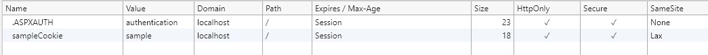

---
title: SameSite cookie sample for ASP.NET 4.7.2 VB WebForms
author: blowdart
description: SameSite cookie sample for ASP.NET 4.7.2 VB WebForms
ms.author: riande
ms.date: 2/15/2019
uid: samesite/vbWF
---

# SameSite cookie sample for ASP.NET 4.7.2 VB WebForms
.NET Framework 4.7 has built-in support for the [SameSite](https://owasp.org/www-community/SameSite) attribute, but it adheres to the original standard.
The patched behavior changed the meaning of `SameSite.None` to emit the attribute with a value of `None`, rather than not emit the value at all. If
you want to not emit the value you can set the `SameSite` property on a cookie to -1.

## <a name="sampleCode"></a>Writing the SameSite attribute

Following is an example of how to write a SameSite attribute on a cookie;

```vb
' Create the cookie
Dim sameSiteCookie As New HttpCookie("sameSiteSample")

' Set a value for the cookie
sameSiteCookie.Value = "sample"

' Set the secure flag, which Chrome's changes will require for SameSite none.
' Note this will also require you to be running on HTTPS
sameSiteCookie.Secure = True

' Set the cookie to HTTP only which is good practice unless you really do need
' to access it client side in scripts.
sameSiteCookie.HttpOnly = True

' Expire the cookie in 1 minute
sameSiteCookie.Expires = Date.Now.AddMinutes(1)

' Add the SameSite attribute, this will emit the attribute with a value of none.
' To Not emit the attribute at all set the SameSite property to -1.
sameSiteCookie.SameSite = SameSiteMode.None

' Add the cookie to the response cookie collection
Response.Cookies.Add(sameSiteCookie)
```

[!INCLUDE[](~/includes/MTcomments.md)]

The default sameSite attribute for a forms authentication cookie is set in the `cookieSameSite` parameter of the forms authentication settings in `web.config` 

```xml
<system.web>
  <authentication mode="Forms">
    <forms name=".ASPXAUTH" loginUrl="~/" cookieSameSite="None" requireSSL="true">
    </forms>
  </authentication>
</system.web>
```

The default sameSite attribute for session state is also set in the 'cookieSameSite' parameter of the session settings in `web.config`

```xml
<system.web>
  <sessionState cookieSameSite="None">     
  </sessionState>
</system.web>
```

The November 2019 update to .NET changed the default settings for Forms Authentication and Session to `lax` as is the most compatible setting, however if you embed pages
into iframes you may need to revert this setting to None, and then add the [interception](#interception) code shown below to adjust the `none` 
behavior depending on browser capability.

### Running the sample

If you run the sample project  load your browser debugger on the initial page and use it to view the cookie collection for the site.
To do so in Edge and Chrome press `F12` then select the `Application` tab and click the site URL under the `Cookies` option in the `Storage` section.



You can see from the image above that the cookie created by the sample when you click the "Create Cookies" button has a SameSite attribute value of `Lax`,
matching the value set in the [sample code](#sampleCode).

## <a name="interception"></a>Intercepting cookies you do not control

.NET 4.5.2 introduced a new event for intercepting the writing of headers, `Response.AddOnSendingHeaders`. This can be used to intercept cookies before they
are returned to the client machine. In the sample we wire up the event to a static method which checks whether the browser supports the new sameSite changes,
and if not, changes the cookies to not emit the attribute if the new `None` value has been set.

See [global.asax](https://github.com/blowdart/AspNetSameSiteSamples/blob/master/AspNet472VisualBasicWebForms/Global.asax.vb) for an example of hooking up the event and
[SameSiteCookieRewriter.cs](https://github.com/blowdart/AspNetSameSiteSamples/blob/master/AspNet472VisualBasicWebForms/SameSiteCookieRewriter.vb) for an example of handling the event and adjusting the cookie `sameSite` attribute.


```vb
Sub FilterSameSiteNoneForIncompatibleUserAgents(ByVal sender As Object)
    Dim application As HttpApplication = TryCast(sender, HttpApplication)

    If application IsNot Nothing Then
        Dim userAgent = application.Context.Request.UserAgent

        If SameSite.DisallowsSameSiteNone(userAgent) Then
            application.Response.AddOnSendingHeaders(
                Function(context)
                    Dim cookies = context.Response.Cookies

                    For i = 0 To cookies.Count - 1
                        Dim cookie = cookies(i)

                        If cookie.SameSite = SameSiteMode.None Then
                            cookie.SameSite = CType((-1), SameSiteMode)
                        End If
                    Next
                End Function)
        End If
    End If
End Sub
```

You can change specific named cookie behavior in much the same way; the sample below adjust the default authentication cookie from `Lax` to
`None` on browsers which support the `None` value, or removes the sameSite attribute on browsers which do not support `None`.

```vb
Public Shared Sub AdjustSpecificCookieSettings()
    HttpContext.Current.Response.AddOnSendingHeaders(Function(context)
            Dim cookies = context.Response.Cookies

            For i = 0 To cookies.Count - 1
            Dim cookie = cookies(i)

            If String.Equals(".ASPXAUTH", cookie.Name, StringComparison.Ordinal) Then

                If SameSite.BrowserDetection.DisallowsSameSiteNone(userAgent) Then
                    cookie.SameSite = -1
                Else
                    cookie.SameSite = SameSiteMode.None
                End If

                cookie.Secure = True
            End If
            Next
        End Function)
End Sub
```

## More Information

[Chrome Updates](https://www.chromium.org/updates/same-site)

[ASP.NET Documentation](/aspnet/samesite/system-web-samesite)

[.NET SameSite Patches](/aspnet/samesite/kbs-samesite)