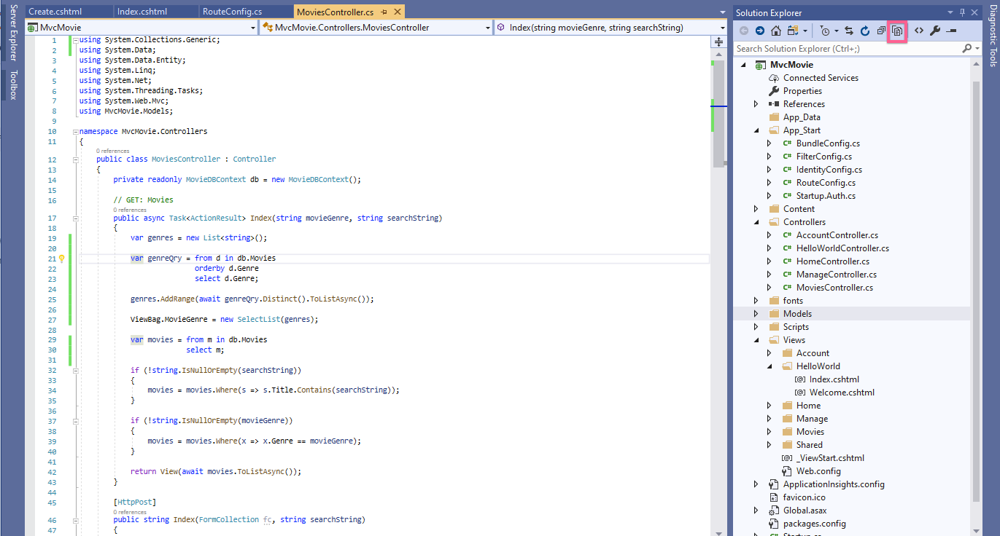
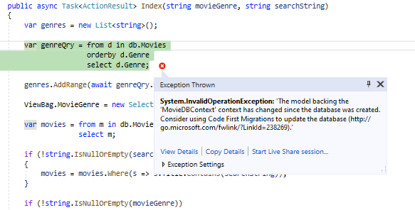

# Adding a New Field

by [Rick Anderson]((https://twitter.com/RickAndMSFT))

[!INCLUDE [Tutorial Note](index.md)]

In this section you'll use Entity Framework Code First Migrations to migrate some changes to the model classes so the change is applied to the database.

By default, when you use Entity Framework Code First to automatically create a database, as you did earlier in this tutorial, Code First adds a table to the database to help track whether the schema of the database is in sync with the model classes it was generated from. If they aren't in sync, the Entity Framework throws an error. This makes it easier to track down issues at development time that you might otherwise only find (by obscure errors) at run time.

## Setting up Code First Migrations for Model Changes

Navigate to Solution Explorer. Right click on the *Movies.mdf* file and select **Delete** to remove the movies database. If you don't see the *Movies.mdf* file, click on the **Show All Files** icon shown below in the red outline.

Build the application to make sure there are no errors.

From the **Tools** menu, click **NuGet Package Manager** and then **Package Manager Console**.

In the **Package Manager Console** window at the `PM>` prompt enter

Enable-Migrations -ContextTypeName MvcMovie.Models.MovieDBContext

The **Enable-Migrations** command (shown above) creates a *Configuration.cs* file in a new *Migrations* folder.

Visual Studio opens the *Configuration.cs* file. Replace the `Seed` method in the *Configuration.cs* file with the following code:

[!code-csharp[Main](adding-a-new-field/samples/sample1.cs)]

Hover over the red squiggly line under `Movie` and click `Show Potential Fixes` and then click **using** **MvcMovie.Models;**

Doing so adds the following using statement:

[!code-csharp[Main](adding-a-new-field/samples/sample2.cs)]

> [!NOTE]
> 
> Code First Migrations calls the `Seed` method after every migration (that is, calling **update-database** in the Package Manager Console), and this method updates rows that have already been inserted, or inserts them if they don't exist yet.
> 
> The [AddOrUpdate](https://msdn.microsoft.com/library/system.data.entity.migrations.idbsetextensions.addorupdate(v=vs.103).aspx) method in the following code performs an "upsert" operation:
> 
> [!code-csharp[Main](adding-a-new-field/samples/sample3.cs)]
> 
> Because the [Seed](https://msdn.microsoft.com/library/hh829453(v=vs.103).aspx) method runs with every migration, you can't just insert data, because the rows you are trying to add will already be there after the first migration that creates the database. The "[upsert](http://en.wikipedia.org/wiki/Upsert)" operation prevents errors that would happen if you try to insert a row that already exists, but it overrides any changes to data that you may have made while testing the application. With test data in some tables you might not want that to happen: in some cases when you change data while testing you want your changes to remain after database updates. In that case you want to do a conditional insert operation: insert a row only if it doesn't already exist.   
> 
> The first parameter passed to the [AddOrUpdate](https://msdn.microsoft.com/library/system.data.entity.migrations.idbsetextensions.addorupdate(v=vs.103).aspx) method specifies the property to use to check if a row already exists. For the test movie data that you are providing, the `Title` property can be used for this purpose since each title in the list is unique:
> 
> [!code-csharp[Main](adding-a-new-field/samples/sample4.cs)]
> 
> This code assumes that titles are unique. If you manually add a duplicate title, you'll get the following exception the next time you perform a migration.   
> 
> *Sequence contains more than one element*  
> 
> For more information about the [AddOrUpdate](https://msdn.microsoft.com/library/system.data.entity.migrations.idbsetextensions.addorupdate(v=vs.103).aspx) method, see [Take care with EF 4.3 AddOrUpdate Method](http://thedatafarm.com/blog/data-access/take-care-with-ef-4-3-addorupdate-method/)..

**Press CTRL-SHIFT-B to build the project.**(The following steps will fail if you don't build at this point.)

The next step is to create a `DbMigration` class for the initial migration. This migration creates a new database, that's why you deleted the *movie.mdf* file in a previous step.

In the **Package Manager Console** window, enter the command `add-migration Initial` to create the initial migration. The name "Initial" is arbitrary and is used to name the migration file created.

Code First Migrations creates another class file in the *Migrations* folder (with the name *{DateStamp}\_Initial.cs* ), and this class contains code that creates the database schema. The migration filename is pre-fixed with a timestamp to help with ordering. Examine the *{DateStamp}\_Initial.cs* file, it contains the instructions to create the `Movies` table for the Movie DB. When you update the database in the instructions below, this *{DateStamp}\_Initial.cs* file will run and create the DB schema. Then the **Seed** method will run to populate the DB with test data.

In the **Package Manager Console**, enter the command `update-database` to create the database and run the `Seed` method.

If you get an error that indicates a table already exists and can't be created, it is probably because you ran the application after you deleted the database and before you executed `update-database`. In that case, delete the *Movies.mdf* file again and retry the `update-database` command. If you still get an error, delete the migrations folder and contents then start with the instructions at the top of this page (that is delete the *Movies.mdf* file then proceed to Enable-Migrations). If you still get an error, open SQL Server Object Explorer and remove the database from the list.

Run the application and navigate to the */Movies* URL. The seed data is displayed.

## Adding a Rating Property to the Movie Model

Start by adding a new `Rating` property to the existing `Movie` class. Open the *Models\Movie.cs* file and add the `Rating` property like this one:

[!code-csharp[Main](adding-a-new-field/samples/sample5.cs)]

The complete `Movie` class now looks like the following code:

[!code-csharp[Main](adding-a-new-field/samples/sample6.cs?highlight=12)]

Build the application (Ctrl+Shift+B).

Because you've added a new field to the `Movie` class, you also need to update the binding *white list* so this new property will be included. Update the `bind` attribute for `Create` and `Edit` action methods to include the `Rating` property:

[!code-csharp[Main](adding-a-new-field/samples/sample7.cs?highlight=1)]

You also need to update the view templates in order to display, create and edit the new `Rating` property in the browser view.

Open the *\Views\Movies\Index.cshtml* file and add a `<th>Rating</th>` column heading just after the **Price** column. Then add a `<td>` column near the end of the template to render the `@item.Rating` value. Below is what the updated *Index.cshtml* view template looks like:

[!code-cshtml[Main](adding-a-new-field/samples/sample8.cshtml?highlight=31-33,52-54)]

Next, open the *\Views\Movies\Create.cshtml* file and add the `Rating` field with the following highlighted markup. This renders a text box so that you can specify a rating when a new movie is created.

[!code-cshtml[Main](adding-a-new-field/samples/sample9.cshtml?highlight=9-15)]

You've now updated the application code to support the new `Rating` property.

Run the application and navigate to the */Movies* URL. When you do this, though, you'll see one of the following errors:

  
  
The model backing the 'MovieDBContext' context has changed since the database was created. Consider using Code First Migrations to update the database (https://go.microsoft.com/fwlink/?LinkId=238269).

You're seeing this error because the updated `Movie` model class in the application is now different than the schema of the `Movie` table of the existing database. (There's no `Rating` column in the database table.)

There are a few approaches to resolving the error:

1. Have the Entity Framework automatically drop and re-create the database based on the new model class schema. This approach is very convenient early in the development cycle when you are doing active development on a test database; it allows you to quickly evolve the model and database schema together. The downside, though, is that you lose existing data in the database — so you *don't* want to use this approach on a production database! Using an initializer to automatically seed a database with test data is often a productive way to develop an application. For more information on Entity Framework database initializers, see [ASP.NET MVC/Entity Framework tutorial](../getting-started-with-ef-using-mvc/creating-an-entity-framework-data-model-for-an-asp-net-mvc-application.md).
2. Explicitly modify the schema of the existing database so that it matches the model classes. The advantage of this approach is that you keep your data. You can make this change either manually or by creating a database change script.
3. Use Code First Migrations to update the database schema.

For this tutorial, we'll use Code First Migrations.

Update the Seed method so that it provides a value for the new column. Open Migrations\Configuration.cs file and add a Rating field to each Movie object.

[!code-csharp[Main](adding-a-new-field/samples/sample10.cs?highlight=6)]

Build the solution, and then open the **Package Manager Console** window and enter the following command:

`add-migration Rating`

The `add-migration` command tells the migration framework to examine the current movie model with the current movie DB schema and create the necessary code to migrate the DB to the new model. The name *Rating* is arbitrary and is used to name the migration file. It's helpful to use a meaningful name for the migration step.

When this command finishes, Visual Studio opens the class file that defines the new `DbMigration` derived class, and in the `Up` method you can see the code that creates the new column.

[!code-csharp[Main](adding-a-new-field/samples/sample11.cs)]

Build the solution, and then enter the `update-database` command in the **Package Manager Console** window.

The following image shows the output in the **Package Manager Console** window (The date stamp prepending *Rating* will be different.)

Re-run the application and navigate to the /Movies URL. You can see the new Rating field.

Click the **Create New** link to add a new movie. Note that you can add a rating.

Click **Create**. The new movie, including the rating, now shows up in the movies listing:

Now that the project is using migrations, you won't need to drop the database when you add a new field or otherwise update the schema. In the next section, we'll make more schema changes and use migrations to update the database.

You should also add the `Rating` field to the Edit, Details, and Delete view templates.

You could enter the "update-database" command in the **Package Manager Console** window again and no migration code would run, because the schema matches the model. However, running "update-database" will run the `Seed` method again, and if you changed any of the Seed data, the changes will be lost because the `Seed` method upserts data. You can read more about the `Seed` method in Tom Dykstra's popular [ASP.NET MVC/Entity Framework tutorial](../getting-started-with-ef-using-mvc/creating-an-entity-framework-data-model-for-an-asp-net-mvc-application.md).

In this section you saw how you can modify model objects and keep the database in sync with the changes. You also learned a way to populate a newly created database with sample data so you can try out scenarios. This was just a quick introduction to Code First, see [Creating an Entity Framework Data Model for an ASP.NET MVC Application](../getting-started-with-ef-using-mvc/creating-an-entity-framework-data-model-for-an-asp-net-mvc-application.md) for a more complete tutorial on the subject. Next, let's look at how you can add richer validation logic to the model classes and enable some business rules to be enforced.

> [!div class="step-by-step"]
> [Previous](adding-search.md)
> [Next](adding-validation.md)
