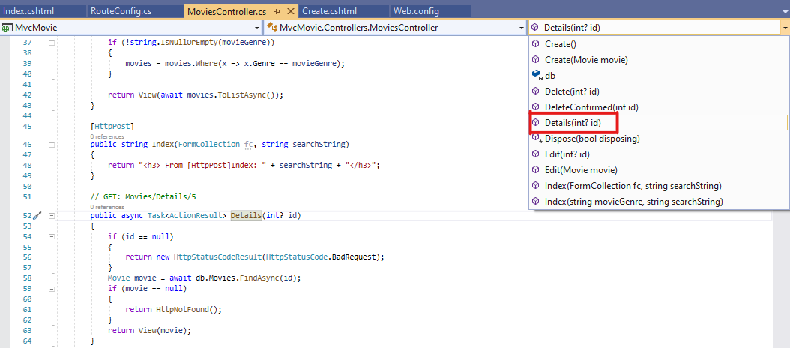

# Examining the Automatically Generated Details and Delete Methods

by [Rick Anderson](https://twitter.com/RickAndMSFT)

[!INCLUDE [consider RP](~/includes/razor.md)]

In this part of the tutorial, you'll examine the automatically generated `Details` and `Delete` methods.

## Examining the Details and Delete Methods

Open the `Movie` controller and examine the `Details` method.

[!code-csharp[Main](examining-the-details-and-delete-methods/samples/sample1.cs)]

The MVC scaffolding engine that created this action method adds a comment showing a HTTP request that invokes the method. In this case it's a `GET` request with three URL segments, the `Movies` controller, the `Details` method and a `ID` value.

Code First makes it easy to search for data using the `Find` method. An important security feature built into the method is that the code verifies that the `Find` method has found a movie before the code tries to do anything with it. For example, a hacker could introduce errors into the site by changing the URL created by the links from `http://localhost:xxxx/Movies/Details/1` to something like `http://localhost:xxxx/Movies/Details/12345` (or some other value that doesn't represent an actual movie). If you did not check for a null movie, a null movie would result in a database error.

Examine the `Delete` and `DeleteConfirmed` methods.

[!code-csharp[Main](examining-the-details-and-delete-methods/samples/sample2.cs?highlight=17)]

Note that the HTTP GET `Delete` method doesn't delete the specified movie, it returns a view of the movie where you can submit (`HttpPost`) the deletion. Performing a delete operation in response to a GET request (or for that matter, performing an edit operation, create operation, or any other operation that changes data) opens up a security hole. For more information about this, see Stephen Walther's blog entry [ASP.NET MVC Tip #46 — Don't use Delete Links because they create Security Holes](http://stephenwalther.com/blog/archive/2009/01/21/asp.net-mvc-tip-46-ndash-donrsquot-use-delete-links-because.aspx).

The `HttpPost` method that deletes the data is named `DeleteConfirmed` to give the HTTP POST method a unique signature or name. The two method signatures are shown below:

[!code-csharp[Main](examining-the-details-and-delete-methods/samples/sample3.cs)]

The common language runtime (CLR) requires overloaded methods to have a unique parameter signature (same method name but different list of parameters). However, here you need two Delete methods -- one for GET and one for POST -- that both have the same parameter signature. (They both need to accept a single integer as a parameter.)

To sort this out, you can do a couple of things. One is to give the methods different names. That's what the scaffolding mechanism did in the preceding example. However, this introduces a small problem: ASP.NET maps segments of a URL to action methods by name, and if you rename a method, routing normally wouldn't be able to find that method. The solution is what you see in the example, which is to add the `ActionName("Delete")` attribute to the `DeleteConfirmed` method. This effectively performs mapping for the routing system so that a URL that includes */Delete/* for a POST request will find the `DeleteConfirmed` method.

Another common way to avoid a problem with methods that have identical names and signatures is to artificially change the signature of the POST method to include an unused parameter. For example, some developers add a parameter type `FormCollection` that is passed to the POST method, and then simply don't use the parameter:

[!code-csharp[Main](examining-the-details-and-delete-methods/samples/sample4.cs)]

## Summary

You now have a complete ASP.NET MVC application that stores data in a local DB database. You can create, read, update, delete, and search for movies.

## Next Steps

After you have built and tested a web application, the next step is to make it available to other people to use over the Internet. To do that, you have to deploy it to a web hosting provider. Microsoft offers free web hosting for up to 10 web sites in a [free Azure trial account](https://www.windowsazure.com/pricing/free-trial/?WT.mc_id=A443DD604). I suggest you next follow my tutorial [Deploy a Secure ASP.NET MVC app with Membership, OAuth, and SQL Database to Azure](/aspnet/core/security/authorization/secure-data). An excellent tutorial is Tom Dykstra's intermediate-level [Creating an Entity Framework Data Model for an ASP.NET MVC Application](../getting-started-with-ef-using-mvc/creating-an-entity-framework-data-model-for-an-asp-net-mvc-application.md). [Stackoverflow](http://stackoverflow.com/help) and the [ASP.NET MVC forums](https://forums.asp.net/1146.aspx) are a great places to ask questions. Follow [me](https://twitter.com/RickAndMSFT) on twitter so you can get updates on my latest tutorials.

Feedback is welcome.

— [Rick Anderson](/archive/blogs/rickAndy/) twitter: [@RickAndMSFT](https://twitter.com/RickAndMSFT)  
— [Scott Hanselman](http://www.hanselman.com/blog/) twitter: [@shanselman](https://twitter.com/shanselman)

> [!div class="step-by-step"]
> [Previous](adding-validation.md)
