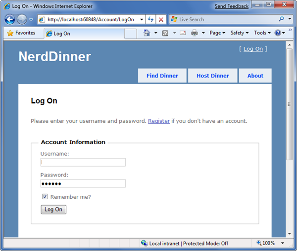

# Introducing the NerdDinner Tutorial

by [Scott Hanselman](https://github.com/shanselman)

[Download PDF](http://aspnetmvcbook.s3.amazonaws.com/aspnetmvc-nerdinner_v1.pdf)

> The best way to learn a new framework is to build something with it. This tutorial walks through how to build a small, but complete, application using ASP.NET MVC 1, and introduces some of the core concepts behind it.
> 
> If you are using ASP.NET MVC 3, we recommend you follow the [Getting Started With MVC 3](../../older-versions/getting-started-with-aspnet-mvc3/cs/intro-to-aspnet-mvc-3.md) or [MVC Music Store](../../older-versions/mvc-music-store/mvc-music-store-part-1.md) tutorials.

## NerdDinner Tutorial

The best way to learn a new framework is to build something with it. This tutorial walks through how to build a small, but complete, application using ASP.NET MVC, and introduces some of the core concepts behind it.

The application we are going to build is called "NerdDinner". NerdDinner provides an easy way for people to find and organize dinners online:

NerdDinner enables registered users to create, edit and delete dinners. It enforces a consistent set of validation and business rules across the application:

Visitors can use an AJAX-based map to search for upcoming dinners being held near them:

Clicking a dinner will take them to a details page where they can learn more about it:

If they are interested in attending the dinner they can login or register on the site:

They can then click an AJAX-based RSVP link to attend the event:

### Implementing NerdDinner

We are going to begin our NerdDinner application by using the File-&gt;New Project command within Visual Studio to create a brand new ASP.NET MVC project. We will then incrementally add functionality and features. Along the way we'll cover:

1. [How to create a new ASP.NET MVC Project](create-a-new-aspnet-mvc-project.md)
2. [How to create a database](create-a-database.md)
3. [How to build a model with business rule validations](build-a-model-with-business-rule-validations.md)
4. [How to use controllers and views to implement a listing/details UI](use-controllers-and-views-to-implement-a-listingdetails-ui.md)
5. [How to provide CRUD (create, read, update, delete) data form entry support](provide-crud-create-read-update-delete-data-form-entry-support.md)
6. [How to use ViewData and implement ViewModel classes](use-viewdata-and-implement-viewmodel-classes.md)
7. [How to re-use UI using master pages and partials](re-use-ui-using-master-pages-and-partials.md)
8. [How to implement efficient data paging](implement-efficient-data-paging.md)
9. [How to secure applications using authentication and authorization](secure-applications-using-authentication-and-authorization.md)
10. [How to use AJAX to deliver dynamic updates](use-ajax-to-deliver-dynamic-updates.md)
11. [How to use AJAX to implement mapping scenarios](use-ajax-to-implement-mapping-scenarios.md)
12. [How to enable automated unit testing](enable-automated-unit-testing.md)

You can build your own copy of NerdDinner from scratch by completing each step we walkthrough in this chapter. Alternatively, you can download a completed version of the source code here: [NerdDinner on GitHub](https://github.com/AspNetMVPSamples/NerdDinner). You can also optionally also [download a free PDF version of this tutorial](http://aspnetmvcbook.s3.amazonaws.com/aspnetmvc-nerdinner_v1.pdf) if you want to read the tutorial offline.

You can use either Visual Studio 2008 or the free Visual Web Developer 2008 Express to build the application. You can use either SQL Server or the free SQL Server Express for the database.

You can install ASP.NET MVC, Visual Web Developer 2008 Express, and SQL Server Express (all free) using V2 of the [Microsoft Web Platform Installer](https://www.microsoft.com/web/downloads/platform.aspx)

### Now let's get started....

Now that we've covered what NerdDinner is, let's roll up our sleeves and write some code.

We'll begin by using File-&gt;New Project within Visual Studio to create the NerdDinner application.

> [!div class="step-by-step"]
> [Next](create-a-new-aspnet-mvc-project.md)
