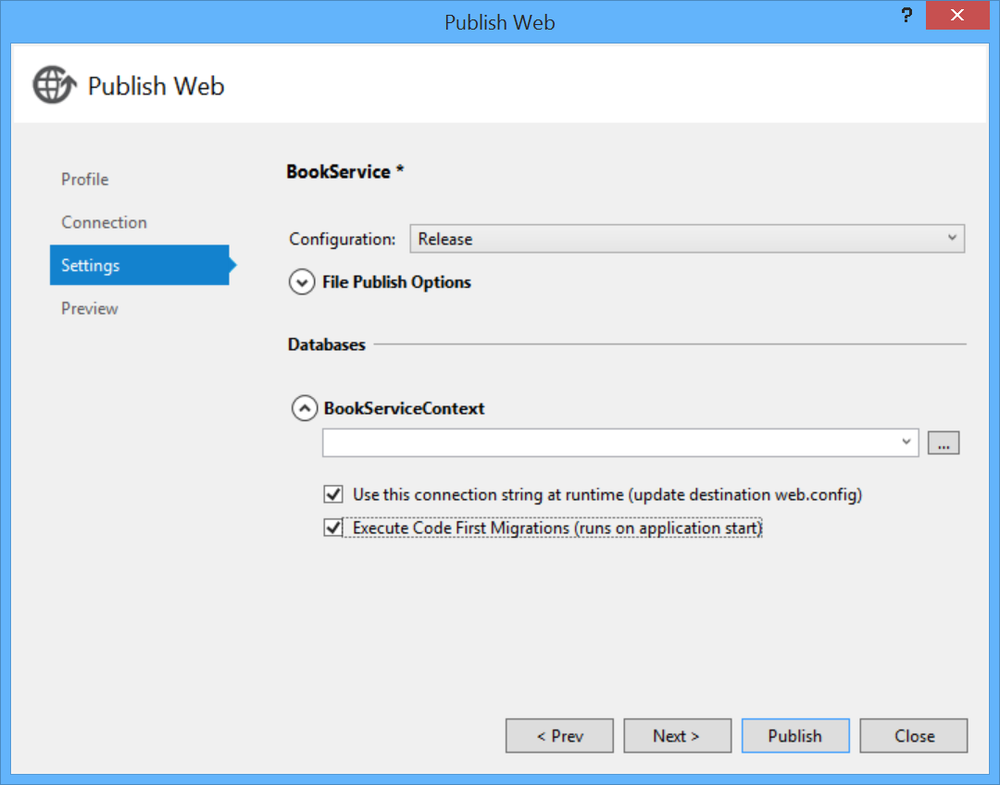
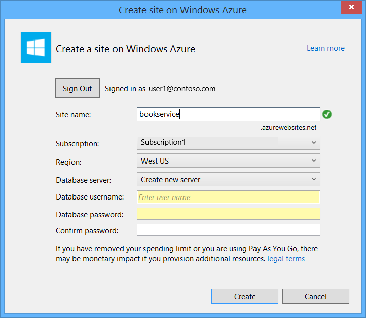

# Publish the App to Azure Azure App Service

[Download Completed Project](https://github.com/MikeWasson/BookService)

As the last step, you will publish the application to Azure. In Solution Explorer, right-click the project and select **Publish**.

Clicking **Publish** invokes the **Publish Web** dialog. If you checked **Host in Cloud** when you first created the project, then the connection and settings are already configured. In that case, just click the **Settings** tab and check &quot;Execute Code First Migrations&quot;. (If you didn't check **Host in Cloud** at the beginning, then follow the steps in the [next section](#new-website).)

To deploy the app, click **Publish**. You can view the publishing progress in the **Web Publish Activity** window. (From the **View** menu, select **Other Windows**, then select **Web Publish Activity**.)

When Visual Studio finishes deploying the app, the default browser automatically opens to the URL of the deployed website, and the application that you created is now running in the cloud. The URL in the browser address bar shows that the site is being loaded from the Internet.

## Deploying to a New Website

If you did not check **Host in Cloud** when you first created the project, you can configure a new web app now. In Solution Explorer, right-click the project and select **Publish**. Select the **Profile** tab and click **Microsoft Azure Websites**. If you aren't currently signed in to Azure, you will be prompted to sign in.

In the **Existing Websites** dialog, click **New**.

Enter a site name. Select your Azure subscription and the region. Under **Database server**, select **Create New Server**, or select an existing server. Click **Create**.

Click the **Settings** tab and check &quot;Execute Code First Migrations&quot;. Then click **Publish**.

> [!div class="step-by-step"]
> [Previous](part-9.md)
