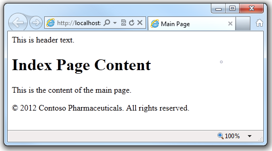
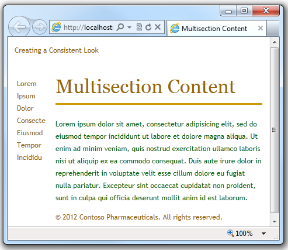
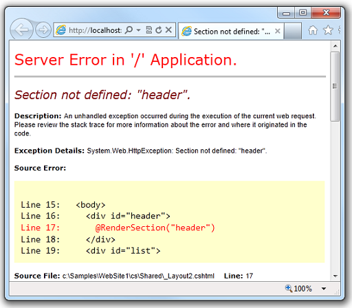
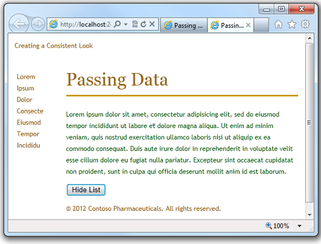
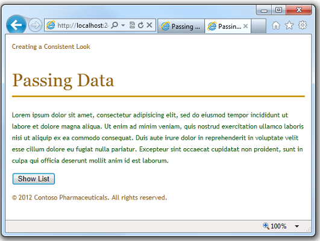

# Creating a Consistent Layout in ASP.NET Web Pages (Razor) Sites

by [Tom FitzMacken](https://github.com/tfitzmac)

> This article explains how you can use layout pages in an ASP.NET Web Pages (Razor) website to create reusable blocks of content (like headers and footers) and to create a consistent look for all the pages in the site.
> 
> **What you'll learn:** 
> 
> - How to create reusable blocks of content like headers and footers.
> - How to create a consistent look for all the pages in your site using a layout.
> - How to pass data at run time to a layout page.
> 
> These are the ASP.NET features introduced in the article:
> 
> - Content blocks, which are files that contain HTML-formatted content to be inserted in multiple pages.
> - Layout pages, which are pages that contain HTML-formatted content that can be shared by pages on the website.
> - The `RenderPage`, `RenderBody`, and `RenderSection` methods, which tell ASP.NET where to insert page elements.
> - The `PageData` dictionary that lets you share data between content blocks and layout pages.
>   
> 
> ## Software versions used in the tutorial
> 
> 
> - ASP.NET Web Pages (Razor) 3
>   
> 
> This tutorial also works with ASP.NET Web Pages 2.

## About Layout Pages

Many websites have content that's displayed on every page, like a header and footer, or a box that tells users that they're logged in. ASP.NET lets you create a separate file with a content block that can contain text, markup, and code, just like a regular web page. You can then insert the content block in other pages on the site where you want the information to appear. That way you don't have to copy and paste the same content into every page. Creating common content like this also makes it easier to update your site. If you need to change the content, you can just update a single file, and the changes are then reflected everywhere the content has been inserted.

The following diagram shows how content blocks work. When a browser requests a page from the web server, ASP.NET inserts the content blocks at the point where the `RenderPage` method is called in the main page. The finished (merged) page is then sent to the browser.

In this procedure, you'll create a page that references two content blocks (a header and a footer) that are located in separate files. You can use these same content blocks in any page in your site. When you're done, you'll get a page like this:

1. In the root folder of your website, create a file named *Index.cshtml*.
2. Replace the existing markup with the following:

    [!code-html[Main](3-creating-a-consistent-look/samples/sample1.html)]
3. In the root folder, create a folder named *Shared*.

    > [!NOTE]
    > It's common practice to store files that are shared among web pages in a folder named *Shared*.
4. In the *Shared* folder, create a file named *\_Header.cshtml*.
5. Replace any existing content with the following:

    [!code-html[Main](3-creating-a-consistent-look/samples/sample2.html)]

    Notice that the file name is *\_Header.cshtml*, with an underscore (\_) as a prefix. ASP.NET won't send a page to the browser if its name starts with an underscore. This prevents people from requesting (inadvertently or otherwise) these pages directly. It's a good idea to use an underscore to name pages that have content blocks in them, because you don't really want users to be able to request these pages &#8212; they exist strictly to be inserted into other pages.
6. In the *Shared* folder, create a file named *\_Footer.cshtml* and replace the content with the following:

    [!code-html[Main](3-creating-a-consistent-look/samples/sample3.html)]
7. In the *Index.cshtml* page, add two calls to the `RenderPage` method, as shown here:

    [!code-html[Main](3-creating-a-consistent-look/samples/sample4.html)]

    This shows how to insert a content block into a web page. You call the `RenderPage` method and pass it the name of the file whose contents you want to insert at that point. Here, you're inserting the contents of the *\_Header.cshtml* and *\_Footer.cshtml* files into the *Index.cshtml* file.
8. Run the *Index.cshtml* page in a browser. (In WebMatrix, in the **Files** workspace, right-click the file and then select **Launch in browser**.)
9. In the browser, view the page source. (For example, in Internet Explorer, right-click the page and then click **View Source**.)

    This lets you see the web page markup that's sent to the browser, which combines the index page markup with the content blocks. The following example shows the page source that's rendered for *Index.cshtml*. The calls to `RenderPage` that you inserted into *Index.cshtml* have been replaced with the actual contents of the header and footer files.

    [!code-html[Main](3-creating-a-consistent-look/samples/sample5.html)]

## Creating a Consistent Look Using Layout Pages

So far you've seen that it's easy to include the same content on multiple pages. A more structured approach to creating a consistent look for a site is to use layout pages. A layout page defines the structure of a web page, but doesn't contain any actual content. After you've created a layout page, you can create web pages that contain the content and then link them to the layout page. When these pages are displayed, they'll be formatted according to the layout page. (In this sense, a layout page acts as a kind of template for content that's defined in other pages.)

The layout page is just like any HTML page, except that it contains a call to the `RenderBody` method. The position of the `RenderBody` method in the layout page determines where the information from the content page will be included.

The following diagram shows how content pages and layout pages are combined at run time to produce the finished web page. The browser requests a content page. The content page has code in it that specifies the layout page to use for the page's structure. In the layout page, the content is inserted at the point where the `RenderBody` method is called. Content blocks can also be inserted into the layout page by calling the `RenderPage` method, the way you did in the previous section. When the web page is complete, it's sent to the browser.

The following procedure shows how to create a layout page and link content pages to it.

1. In the *Shared* folder of your website, create a file named *\_Layout1.cshtml*.
2. Replace any existing content with the following:

    [!code-html[Main](3-creating-a-consistent-look/samples/sample6.html)]

    You use the `RenderPage` method in a layout page to insert content blocks. A layout page can contain only one call to the `RenderBody` method.
3. In the *Shared* folder, create a file named *\_Header2.cshtml* and replace any existing content with the following:

    [!code-html[Main](3-creating-a-consistent-look/samples/sample7.html)]
4. In the root folder, create a new folder and name it *Styles*.
5. In the *Styles* folder, create a file named *Site.css* and add the following style definitions:

    [!code-css[Main](3-creating-a-consistent-look/samples/sample8.css)]

    These style definitions are here only to show how style sheets can be used with layout pages. If you want, you can define your own styles for these elements.
6. In the root folder, create a file named *Content1.cshtml* and replace any existing content with the following:

    [!code-cshtml[Main](3-creating-a-consistent-look/samples/sample9.cshtml)]

    This is a page that will use a layout page. The code block at the top of the page indicates which layout page to use to format this content.
7. Run *Content1.cshtml* in a browser. The rendered page uses the format and style sheet defined in *\_Layout1.cshtml* and the text (content) defined in *Content1.cshtml*.

    ![[The screenshot shows running Content 1 dot CSHTML in a browser.]](3-creating-a-consistent-look/_static/image4.png)

    You can repeat step 6 to create additional content pages that can then share the same layout page.

    > [!NOTE]
    > You can set up your site so that you can automatically use the same layout page for all the content pages in a folder. For details, see [Customizing Site-Wide Behavior for ASP.NET Web Pages](https://go.microsoft.com/fwlink/?LinkId=202906).

## Designing Layout Pages That Have Multiple Content Sections

A content page can have multiple sections, which is useful if you want to use layouts that have multiple areas with replaceable content. In the content page, you give each section a unique name. (The default section is left unnamed.) In the layout page, you add a `RenderBody` method to specify where the unnamed (default) section should appear. You then add separate `RenderSection` methods in order to render named sections individually.

The following diagram shows how ASP.NET handles content that's divided into multiple sections. Each named section is contained in a section block in the content page. (They're named `Header` and `List` in the example.) The framework inserts content section into the layout page at the point where the `RenderSection` method is called. The unnamed (default) section is inserted at the point where the `RenderBody` method is called, as you saw earlier.

This procedure shows how to create a content page that has multiple content sections and how to render it using a layout page that supports multiple content sections.

1. In the *Shared* folder, create a file named *\_Layout2.cshtml*.
2. Replace any existing content with the following:

    [!code-html[Main](3-creating-a-consistent-look/samples/sample10.html)]

    You use the `RenderSection` method to render both the header and list sections.
3. In the root folder, create a file named *Content2.cshtml* and replace any existing content with the following:

    [!code-cshtml[Main](3-creating-a-consistent-look/samples/sample11.cshtml)]

    This content page contains a code block at the top of the page. Each named section is contained in a section block. The rest of the page contains the default (unnamed) content section.
4. Run *Content2.cshtml* in a browser.

    

## Making Content Sections Optional

Normally, the sections that you create in a content page have to match sections that are defined in the layout page. You can get errors if any of the following occur:

- The content page contains a section that has no corresponding section in the layout page.
- The layout page contains a section for which there's no content.
- The layout page includes method calls that try to render the same section more than once.

However, you can override this behavior for a named section by declaring the section to be optional in the layout page. This lets you define multiple content pages that can share a layout page but that might or might not have content for a specific section.

1. Open *Content2.cshtml* and remove the following section:

    [!code-cshtml[Main](3-creating-a-consistent-look/samples/sample12.cshtml)]
2. Save the page and then run it in a browser. An error message is displayed, because the content page doesn't provide content for a section defined in the layout page, namely the header section.

    
3. In the *Shared* folder, open the *\_Layout2.cshtml* page and replace this line:

    [!code-javascript[Main](3-creating-a-consistent-look/samples/sample13.js)]

    with the following code:

    [!code-javascript[Main](3-creating-a-consistent-look/samples/sample14.js)]

    As an alternative, you could replace the previous line of code with the following code block, which produces the same results:

    [!code-cshtml[Main](3-creating-a-consistent-look/samples/sample15.cshtml)]
4. Run the *Content2.cshtml* page in a browser again. (If you still have this page open in the browser, you can just refresh it.) This time the page is displayed with no error, even though it has no header.

## Passing Data to Layout Pages

You might have data defined in the content page that you need to refer to in a layout page. If so, you need to pass the data from the content page to the layout page. For example, you might want to display the login status of a user, or you might want to show or hide content areas based on user input.

To pass data from a content page to a layout page, you can put values into the `PageData` property of the content page. The `PageData` property is a collection of name/value pairs that hold the data that you want to pass between pages. In the layout page, you can then read values out of the `PageData` property.

Here's another diagram. This one shows how ASP.NET can use the `PageData` property to pass values from a content page to the layout page. When ASP.NET begins building the web page, it creates the `PageData` collection. In the content page, you write code to put data in the `PageData` collection. Values in the `PageData` collection can also be accessed by other sections in the content page or by additional content blocks.

The following procedure shows how to pass data from a content page to a layout page. When the page runs, it displays a button that lets the user hide or show a list that's defined in the layout page. When users click the button, it sets a true/false (Boolean) value in the `PageData` property. The layout page reads that value, and if it's false, hides the list. The value is also used in the content page to determine whether to display the **Hide List** button or the **Show List** button.

![[Screenshot shows the Passing Data page.]](3-creating-a-consistent-look/_static/image9.jpg)

1. In the root folder, create a file named *Content3.cshtml* and replace any existing content with the following:

    [!code-cshtml[Main](3-creating-a-consistent-look/samples/sample16.cshtml)]

    The code stores two pieces of data in the `PageData` property &#8212; the title of the web page and true or false to specify whether to display a list.

    Notice that ASP.NET lets you put HTML markup into the page conditionally using a code block. For example, the `if/else` block in the body of the page determines which form to display depending on whether `PageData["ShowList"]` is set to true.
2. In the *Shared* folder, create a file named *\_Layout3.cshtml* and replace any existing content with the following:

    [!code-cshtml[Main](3-creating-a-consistent-look/samples/sample17.cshtml)]

    The layout page includes an expression in the `<title>` element that gets the title value from the `PageData` property. It also uses the `ShowList` value of the `PageData` property to determine whether to display the list content block.
3. In the *Shared* folder, create a file named *\_List.cshtml* and replace any existing content with the following:

    [!code-html[Main](3-creating-a-consistent-look/samples/sample18.html)]
4. Run the *Content3.cshtml* page in a browser. The page is displayed with the list visible on the left side of the page and a **Hide List** button at the bottom.

    
5. Click **Hide List**. The list disappears and the button changes to **Show List**.

    
6. Click the **Show List** button, and the list is displayed again.

## Additional Resources

[Customizing Site-Wide Behavior for ASP.NET Web Pages](https://go.microsoft.com/fwlink/?LinkId=202906)
